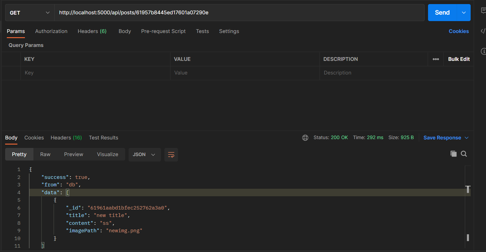
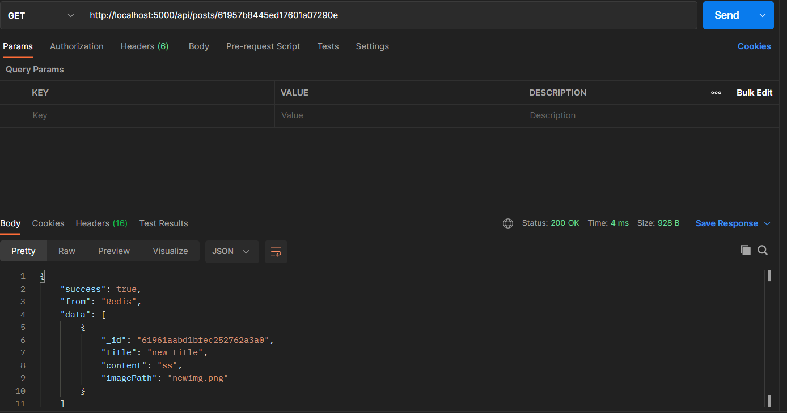

# MERN stack application with advanced REST API authentication

#### This is a bare-bones example of a very fast application providing a REST API to a mongoose ODM AND with implementation of Redis.

**The entire application is contained within the repository including the client.**

#### Note that you need to run

`npm install //for both frontend and backend`

#### Don't forget to add config.env and it's variables and there is a sample included in the repo.

#### All of the API routes are exported to postman json collection inside:

[POSTMAN COLLECTION](MERN_advanced_Auth.postman_collection.json)

## UPDATE : Added Redis

### See the difference in both api calls and how Redis made it super fast

**Without Redis: It took 292ms to respond!**

**With Redis: Where you can see it only took 4ms to send a response**

